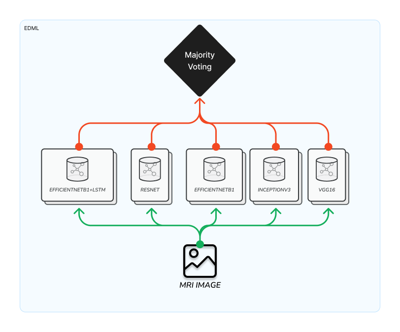
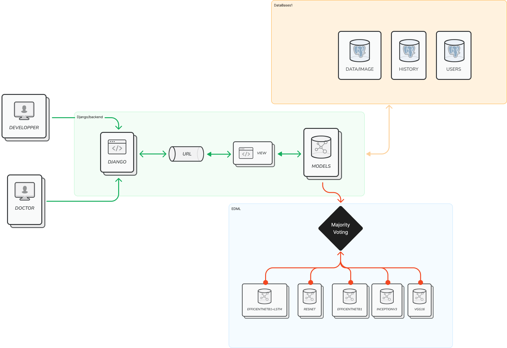

# Ensemble Learning for Brain Tumor Classification
<div align="center">


</div>


BRAINY is a webapp that classifies MRI images of the brain to detect the type of brain tumor a patient has. The webapp uses ensemble machine learning, specifically majority voting. It utilizes five models to determine the final result: EfficientNetB1, EfficientNetB1+LSTM, InceptionV3, ResNet, and VGG16.

## Features
BRAINY is equipped with several features including:
- Authentication
- MRI Classification
- User History




# Installation
to start developmenet with Tailwind , make sure to run it with runserver

```
npm install tailwindcss cross-env postcss-import postcss-simple-vars postcss-nested flowbite @tailwindcss/typography @tailwindcss/aspect-ratio --save-dev 
```
```
pip install -r requirement.txt
```

to run the server
```
python manage.py runserver
```


Run Tailwind CSS 
```
python manage.py tailwind start
```

Models link:
```
https://drive.google.com/drive/folders/1_5oMUmwwQRvEs_ICWAonNplaTB7WO34Z?usp=sharing
```

# The App Map
```
~\brainproject
    ~\brainproject   #project Settings
    ~\brainy         #Main Application
        ~\static
        ~\templates
    ~\media          #The models saved here
    ~\theme  
        ~\static_src #tailwind Configuration   

```